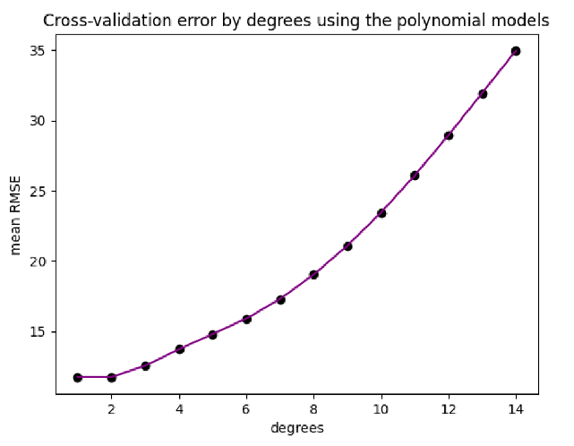

by: [Quang Dong Nguyen](https://github.com/Quang2003-SpicyCarrot)  
provided by: Western Sydney University


  

# Key problems for task 1: Find the most accurate ML model for Systolic blood pressure prediction.
# Key problems for task 2: Examine the effectiveness of each ML model on the "MNIST784" dataset from sklearn.

## Table of Contents
- [Data Source](#data-source)
- [Analysis Questions](#analysis-questions)
- [Library](#library)
- [Method](#methods)
- [Step Summary](#steps-summary)
- [Review of Results](#quick-review-of-the-results)


## Data Source
- *bloodpressure-23.csv*: A medical facility's health record captures details regarding patients'daily practices and other significnat metrics, including IQ, sodium levels,
genders, marital status, and more.
- *mnist784*: The MNIST (Modified National Institute of Standards and Technology) data is a record of 70,000 training images and 10,000 test images.
Each image is a 28 x 28 (784 pixels) handwritten digit from "0" to "9", where each pixel value is a grayscale integer between 0 and 255.


## Analysis Questions
### Task 1
1. Blood pressure dataset pressure.csv contains examples of systolic pressures and
other features from different persons.
2. Create polynomial regression models, to predict systolic pressure using the SERUMCHOL feature, for degrees vary from 1 to 14. Perform 10-fold cross validation.
Calculate its square roots of the mean square errors (RMSE), and the mean RMSE.
Display the mean RMSEs for the 14 different degrees. Produce a cross validation
error plot using the mean RMSE with 1 to 14 different degrees.
3. Select the best degree, and explains why briefly. Print its intercept and coefficients.
4. Create a multiple linear regression model to predict systolic pressure using all the
relevant features. Print its coefficients. Perform 10-fold cross validation. Calculate
its square roots of the mean square errors (RMSE), and the mean RMSE, and display
the mean RMSE.
5. Build a ridge regression model of the above (i.e. item 4) using α = 0.1. Print its
coefficients. Perform 10-fold cross validation. Calculate its square roots of the mean
square errors (RMSE), and the mean RMSE, and display the mean RMSE.
6. Select the best model of the three, and explains why briefly

### Task 2
1. This task involves MNIST Digit Classification using PCA and Logistic Regression.
Load the renowned MNIST (’mnist 784’) dataset, which consists of a large collection
of handwritten digit images. Your task is to reduce the number of features first, and
then build a binary classification model to distinguish between the digit “6” and all
other digits (not “6”).
2. Perform Principal Component Analysis (PCA) on the feature data to reduce its dimensionality while retaining 88% of the overall explained variance ratio.
3. Split the data into training and testing sets. A common split ratio is 80% training
and 20% testing.
4. Create a Logistic Regression model using the reduced feature dataset.
5. Use this model to predict the language for the training dataset and the testing
dataset.
6. Print the number of principal components preserved. Print the prediction accuracy
(proportion of correct predictions) of your model on the training set. Print the
prediction accuracy, the confusion matrix, and the misclassified digits (i.e. wrong
predicitons) of your model on the testing set.
7. What do you think of the model generated (good, underfit, overfit)? Briefly explains
why


## Library:
- ML: sklearn
- Data Visualisation: matplotlib
- Dataframe Manipulation: pandas, numpy, 

## Methods:
### Task 1:
- Polynomial regression, Multiple Linear Regression, Ridge regression
- K-fold Cross-Validation 
- Optimal Model Selection

### Task 2:
- Training and testing data split
- PCA (Principal Component Analysis)
- Logistic Regression
- Model predictions and misclassification prediction.


## Steps summary:
```
Task 1: Regression
|- import data and libraries
|- Visualisation of Serum-chol level vs systolic level
|- Build a polynomial regression model with a degree from 1 to 15 to predict systolic pressure
|- Calculate the cross-validation error from the model using 10-fold cross-validation.
|- Plot the Cross Validation Error by degrees graph
|- Select the best degree of the model
|
| 
|- Create a multiple linear regression model to predict systolic pressure
|- Perform 10-fold cross-validation and calculate the cross-validation error.
|- Select the model that generated the lowest mean RMSE score.
|
|
|- Build a ridge regression model of the model above using alpha = 0.1
|- Perform 10-fold cross-validation and calculate the rMSE and the mean rMSE
|- Select the model that has the lowest mean rMSE.
|
|- Out of the 3 model, the Ridge Regression is the best model


Task 2: Classification
|- import libraries and dataset from sklearn library
|- separate all the features and the target data
|- Perform PCA while retaining 88% of the variance
|
|- Split the data into training and testing set
|- Create a logistic regression model using the training set
|- Predict values for testing sets
|- Create a confusion matrix on the model above
|- Checking model validity: the model is well-made with highly accurate prediction.

```


## Quick review of the results:

